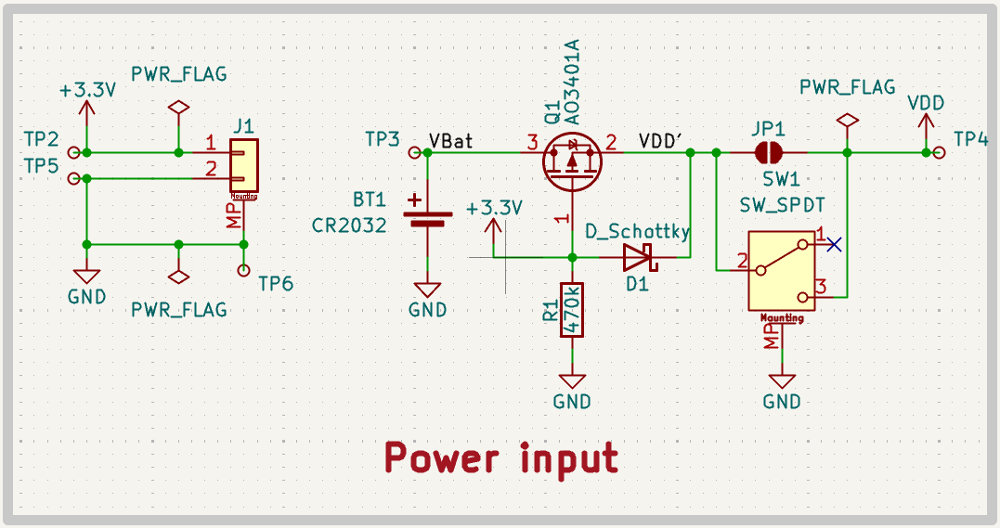

# Raport - pobór prądu węzła LPN w BLE Mesh

Teoria standardu BLE Mesh (warstwa radiowa, managed flooding, adresowanie,
role węzłów, provisioning) jest w [Teoria-BLE-Mesh.md](Teoria-BLE-Mesh.md). Architektura tego
projektu (role Friend i LPN, implementacja, ograniczenia) jest w
[README.md](../README.md).

---

## Cel

Węzeł LPN w pierwszej wersji firmware pobierał w spoczynku około 200 µA. Firmware referencyjny na tej samej płytce pobierał 2,49 µA. Praca nad
tą różnicą miała trzy etapy:

1. Usunięcie zbędnych peryferiów (dioda LED, nieużywane czujniki, stałe
   zasilanie czujnika).
2. Ustalenie poprawnej metodyki pomiaru PPK2 na płytce BTZ (patrz sekcja
   "Poprawny pomiar PPK2" niżej).
3. Wyłączenie nieużywanego RAM-u i skrócenie okna odbioru Frienda.
4. System OFF vs System ON.

## Wynik - podsumowanie

| Etap | Pobór w spoczynku |
|---|---|
| Stan wyjściowy | ~200 µA |
| Po usunięciu diody LED | ~65 µA |
| Po wyłączeniu nieużywanych czujników i bramkowaniu zasilania | ~3 µA |
| Po wyłączeniu nieużywanego RAM-u (`lpn_mock`) | **1,5 µA** |

---

## Optymalizacje System ON

Dotyczą aplikacji `lpn` (prawdziwy pomiar) i `lpn_mock` (udawany pomiar).

### Poprawny pomiar PPK2 (podłączenie przez JP1)

Pomiary PPK2 na płytce BTZ_EndDevice pokazywały nadwyżkę ~6-7 µA względem
wartości katalogowej, niezależnie od stanu firmware. Przyczyn był rezystor R1
(470 kΩ) w sekcji zasilania płytki. Gdy PPK2 podłączone jest do
pinu +3,3 V, to napięcie utrzymuje R1 pod pełnym napięciem
zasilania - stała ścieżka prądu do masy (U/R: 3,0 V / 470 kΩ ≈ 6,4 µA).

**Naprawa:** zasilaj i mierz płytkę przez złącze **JP1**, nie
przez wejście +3,3 V.

**Wynik:** pobór w System OFF spadł z ~7,3
µA do **0,91 µA**, zgodnie z wartością
katalogową dla nRF54L15. Potwierdzone porównaniem z płytką referencyjną
nRF54L15 DK (0,95 µA tym samym firmware).

### Peryferia i GPIO

| Źródło | Koszt | Poprawka |
|---|---|---|
| Pin diody LED (P2.08) skonfigurowany jako wyjście | ~135 µA | Usunięta cała obsługa LED z `lpn` i `lpn_mock` |
| Nieużywane czujniki LTR329 (światło) i BMI270 (IMU) na magistrali I2C | piki ~192 µA co 500 ms | Oznaczone `disabled` w nakładce devicetree - Zephyr ich nie inicjalizuje |
| Szyna zasilania czujników trzymana na stałe (`regulator-boot-on`) | ~65 µA (dominujący składnik) | Zasilanie włączane tylko na czas odczytu STS4X |

Aplikacja czyta tylko czujnik STS4X (temperatura). Zephyr domyślnie
inicjalizuje **każdy** czujnik zadeklarowany w devicetree, nie tylko
używane - stąd koszt LTR329 i BMI270, mimo że dane z nich nigdy nie były
odczytywane.

Bramkowanie zasilania czujnika daje krótki prąd rozruchowy przy każdym
włączeniu szyny (ładowanie kondensatorów odsprzęgających). Uśredniony koszt
tego zjawiska to ~0,4 µA - pomijalny wobec 65 µA zaoszczędzonych przez samo
bramkowanie.

### Dostrojenie czujnika STS4X

- **Tryb pomiaru (repeatability):** zmieniony z "high" (8,3 ms pomiaru) na
  "low" (1,6 ms). Dokładność wystarczająca do monitoringu temperatury
  otoczenia.
- **Czas rozgrzewania szyny:** skrócony z 5 ms do 2 ms. STS4X jest gotowy do
  odczytu po ~1 ms - 5 ms był zapasem większym niż potrzeba.

Efekt obu zmian razem: pobór `lpn` spadł z 14,58 µA do 13,4 µA (poll co
60 s, przed wdrożeniem RAM power-down).

### Wyłączenie nieużywanego RAM-u

nRF54L15 dzieli RAM na 8 sekcji po 32 kB (256 kB razem). Aplikacja `lpn_mock`
zajmuje sekcje 0-1 (64 kB). Sekcje 2-7 (192 kB) nie są używane, ale bez
dodatkowej konfiguracji zostają zasilone.

`CONFIG_RAM_POWER_DOWN_LIBRARY` wyłącza zasilanie nieużywanych sekcji w
trybie System ON.

**Zajętość pamięci po dodaniu tej flagi (`lpn_mock`):**

nRF54L15 ma **1,5 MB flasha** (1 572 864 B) i **256 kB RAM-u** (262 144 B) -
te same wartości, co w projekcie `matter-end-device` (ta sama płytka
BTZ_EndDevice/nrf54l15/cpuapp).

| Region | Użyte | Dostępne | Wykorzystanie | Zapas |
|---|---|---|---|---|
| FLASH | 208 032 B | 1 572 864 B | 13,33% | 1 364 832 B |
| RAM | 55 192 B | 262 144 B | 21,05% | 206 952 B |

**Zmierzony wynik:** pobór spoczynkowy `lpn_mock` z tą zmianą to **1,5 µA**. Tabela producenta podaje ~3,0 µA dla System ON idle z GRTC i
**pełnymi 256 kB RAM w retencji** - stanu sprzed tej zmiany.

---

## Koszt komunikacji LPN - Friend

### Rozmiar wiadomości (Network PDU, czyli to, co leci w eter)

| Wiadomość | Rozmiar | Retransmisje |
|---|---|---|
| Friend Poll | 19 bajtów | 0  |
| Sensor Status (publikacja temperatury) | 22 bajty | 2 (co 20 ms, domyślnie:`CONFIG_BT_MESH_NETWORK_TRANSMIT_COUNT`) |

### Koszt jednego Friend Polla

Friend Poll jest lekki wagowo, ale kosztowny czasowo - LPN musi trzymać
odbiornik włączony, czekając na odpowiedź:

1. LPN wysyła Poll (TX, ułamek milisekundy).
2. LPN czeka **ReceiveDelay** - 100 ms (`CONFIG_BT_MESH_LPN_RECV_DELAY`,
   domyślne). To czas na przygotowanie odpowiedzi po stronie Frienda.
3. LPN włącza odbiornik na **ReceiveWindow**. Tę wartość deklaruje Friend
   przy nawiązaniu friendship (`CONFIG_BT_MESH_FRIEND_RECV_WIN`).

Domyślna wartość `CONFIG_BT_MESH_FRIEND_RECV_WIN` w Zephyrze to 255 ms -
maksimum dopuszczalne przez Kconfig. LPN mógł trzymać odbiornik włączony do
255 ms na każdy Poll, nawet gdy Friend odpowiadał od razu. Zmieniliśmy tę
wartość na **50 ms** w `apps/friend/prj.conf`. Friend jest zasilany z USB -
skrócenie tego okna nic go nie kosztuje, a LPN-owi skraca budżet czasowy RX
przy każdym Pollu.

### Zmierzony koszt energetyczny

Zmierzony ładunek pojedynczej transmisji:

| Zdarzenie | Ładunek |
|---|---|
| Friend Poll | 56 µC |
| Publikacja Sensor Status | 20 µC |

### Pomiar średniego poboru prądu w funkcji interwału (`lpn_mock`)

| Interwał [s] | I_avg - tylko publikacja [µA] | I_avg - publikacja + Poll [µA] |
|:---:|:---:|:---:|
| 10 | 3,64 | 10,20 |
| 20 | 2,54 | 5,00 |
| 30 | 2,17 | 4,00 |
| 60 | 1,82 | 2,70 |
| 120 | 1,72 | 2,30 |
| 300 | 1,62 | 1,80 |
| 600 | 1,58 | 1,6 |

Pełne dane pomiarowe: [arkusz Google Sheets](https://docs.google.com/spreadsheets/d/1gNK6X7evr7V1AWbSqUhf2QMvSOTeYyxt/edit?usp=sharing&ouid=103337996382107983686&rtpof=true&sd=true).

## Porównania

### `lpn` vs `lpn_mock` (Sensor Status co 20s, bez Friend Poll)

| | `lpn`  | `lpn_mock`  |
|---|---|---|
| Średni pobór | 5,7 µA | 2,5 µA |

Różnica ~3,2 µA to koszt odczytu realnego czujnika STS4X.

### `System ON` vs `System OFF` - dlaczego friendship wyklucza deep sleep

Tych trybów nie porównujemy pomiarem. Standard BLE Mesh nie przewiduje deep
sleep, czyli trybu System OFF, dla węzła w friendship. LPN śpi w trybie System ON
idle: radio jest wyłączone, RAM zostaje podtrzymany, stos mesh żyje.

1. **Stan friendship istnieje tylko w RAM.** Stos nie utrwala adresu Frienda,
   friend credentials, FSN, LPNCounter ani listy subskrypcji. Utrwala klucze,
   adresy, IV Index, seq i RPL. System OFF kończy się resetem, więc każda pobudka
   wymaga nowego Friend Requestu.
2. **Friend credentials zależą od liczników sesji.** LPN podaje LPNCounter
   w Friend Requeście, Friend podaje FriendCounter w Friend Offerze. Reset zeruje
   LPNCounter. Standard nie definiuje wznowienia friendship.
3. **Licznik seq musi rosnąć monotonicznie.** Inaczej Friend odrzuca wiadomość na
   RPL. Deep sleep wymaga więc nośnika: flasha (`CONFIG_BT_SETTINGS`) albo
   retencji RAM (`overlay-ret.conf` i `CONFIG_LPN_SEQ_MARGIN`).
4. **Nordic nie zaleca System OFF dla LPN-a.** Lista optymalizacji LPN w nRF
   Connect SDK go nie wymienia. Nordic używa System OFF do wyłączania węzła
   (`bt_mesh_suspend()`, pobudka przyciskiem), a nie do cyklu Polla.

Skutek: nawiązanie friendship kosztuje więcej energii niż jego utrzymanie, a
węzeł z System OFF płaci ten koszt w każdym cyklu. W tej aplikacji powrót do
sieci trwa ponad 30 s z pracującym radiem. Zysk jest mały: 0,91 µA w System OFF
wobec 1,5 µA w System ON idle.

Źródła: [lista optymalizacji LPN w NCS](https://developer.nordicsemi.com/nRF_Connect_SDK/doc/latest/nrf/protocols/bt/bt_mesh/configuring.html),
[System OFF jako tryb wyłączenia węzła](https://devzone.nordicsemi.com/f/nordic-q-a/91937/put-ble-mesh-node-in-deep-sleep/396214),
[Zephyr #32256](https://github.com/zephyrproject-rtos/zephyr/issues/32256),
[ESP-IDF #5484](https://github.com/espressif/esp-idf/issues/5484).

### `Repeat` vs `ACK`

`Repeat`: LPN wysyła Sensor Status jako broadcast. LPN nie czeka na
odpowiedź. LPN wysyła wiadomość 3 razy (`NETWORK_TRANSMIT_COUNT`, domyślnie
2 powtórki). LPN wysyła powtórki w odstępie 20 ms (`NETWORK_TRANSMIT_INTERVAL`).
LPN nie wie, czy Friend odebrał wiadomość. Każda transmisja używa kanałów
reklamowych 37, 38 i 39.

`ACK`: LPN wysyła Poll od razu po publikacji. Friend wstawia potwierdzenie tej
wiadomości do Friend Queue. LPN odbiera potwierdzenie w oknie RX Polla. Ten
wariant dodaje koszt jednego Polla do każdej publikacji.

| Interwał [s] | `Repeat` [µA] | `ACK` [µA] |
|:---:|:---:|:---:|
| 10 | 3,64 | 10,20 |
| 20 | 2,54 | 5,00 |
| 30 | 2,17 | 4,00 |
| 60 | 1,82 | 2,70 |
| 120 | 1,72 | 2,30 |
| 300 | 1,62 | 1,80 |
| 600 | 1,58 | 1,6 |

---

